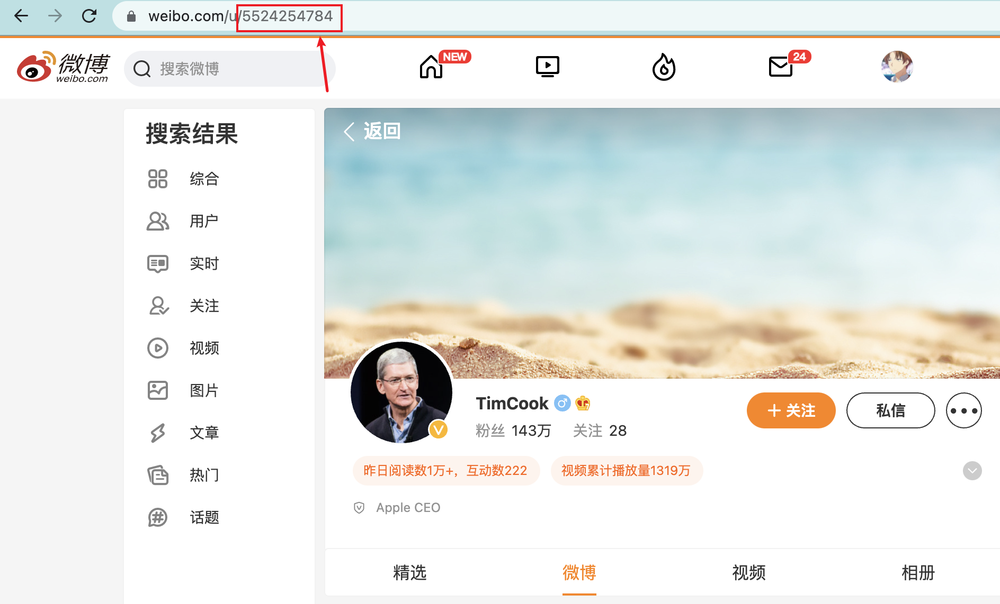
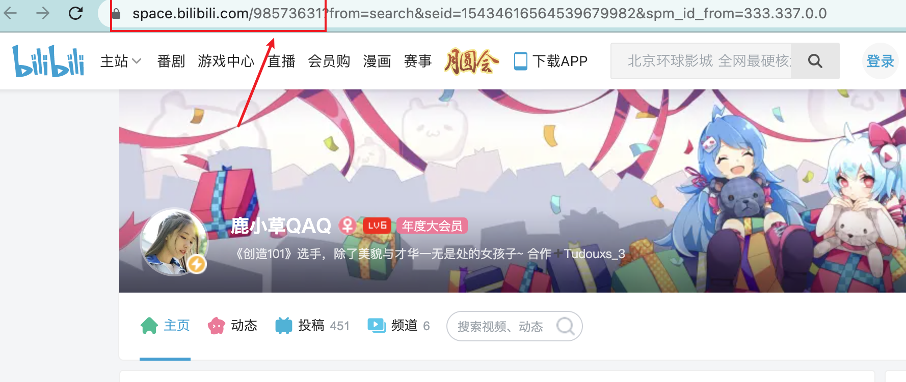
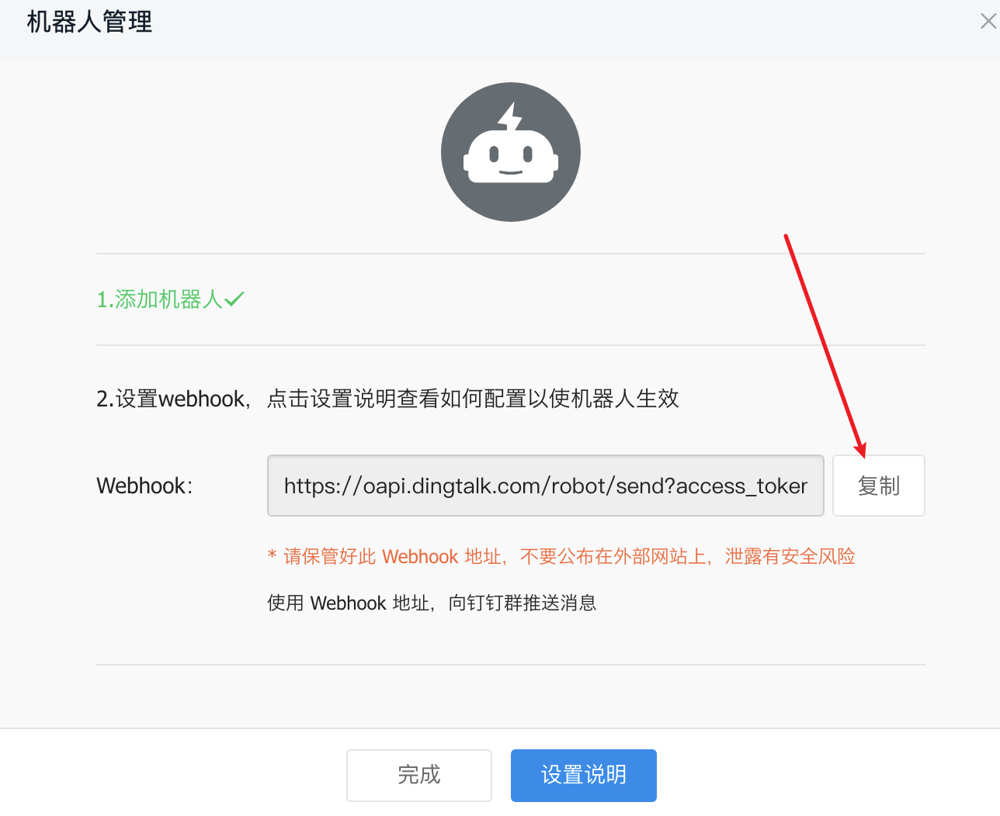
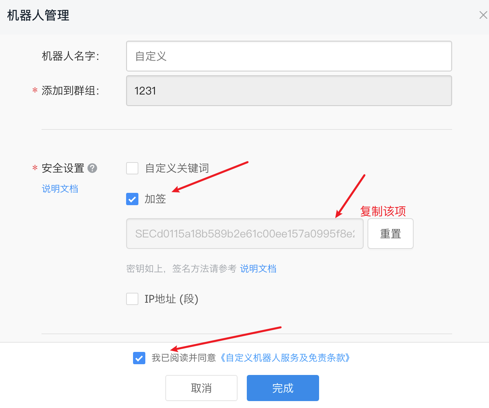

# SakurajimaMai

**信息聚合自动推送机器人**

初衷：笔者经常关注b站和微博一些有意思的自媒体或者比赛信息，但是如果按照了b站和微博会不知不觉被吸引从而耗费掉大量的时间（自从我卸载了这些社交媒体之后，发现自己多了很多时间），但是还是想要关注这类博主的更新，于是自己决定编写一个自动推送更新的机器人来告知更新，同时常常忘记吃饭，顺带加上了提醒我点外卖吃饭的功能。

*私はいつも桜島麻衣が好きです*

## 目前已经实现的功能(Function)

1.微博监控（关注博主更新后提醒）

2.B站监控（关注up主更新后提醒）

3.定时提醒吃饭，设定好吃饭时间之后到时间会推送

4.等着填坑

## 如何配置(Setting)

Fork[本项目](https://github.com/0chencc/SakurajimaMai)，在Setting->Secret中配置需要的环境变量

必要变量，钉钉机器人的WEBHOOK，SECRET（密钥）-> [如何配置](#配置钉钉机器人)

吃饭则是一日三餐的时间，我早餐(**BREAKFAST**)不吃，午餐(**LUNCH**)，晚餐(**DINNER**)吃，github的云函数的时区是**UTC**，所以需要减8小时。比方说我午餐是11点吃，那么就需要设置**LUNCH=0300**，晚餐是17点30吃，则是**DINNER=0930**

微博则是**WB_UIDS**，需要用逗号作为分隔，例如->**WB_UIDS=2099708877,5524254784**

同理b站则是**BIDS**，例如->**BIDS=5970160,98573631**

以上都是用户id，微博就是该用户主页之后的那串数字，b站up主则是up主个人空间网址的那串数字

## 配置钉钉机器人

需要注册一个钉钉账号，同时建立一个群聊（电脑端可以创建只有自己的群聊）

添加一个webhook机器人，验证方式选用加签，如图：

之后就需要在Setting->Secret中配置WEBHOOK为钉钉机器人的webhook地址，SECRET为密钥